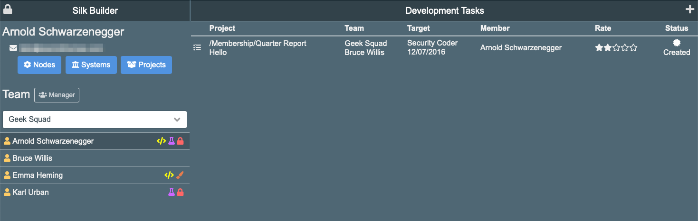
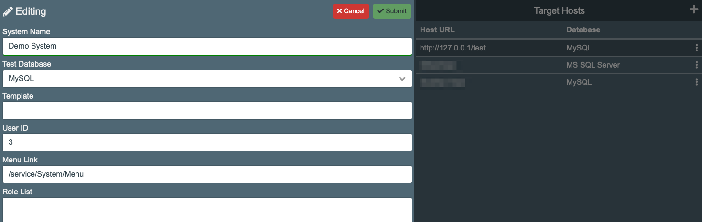
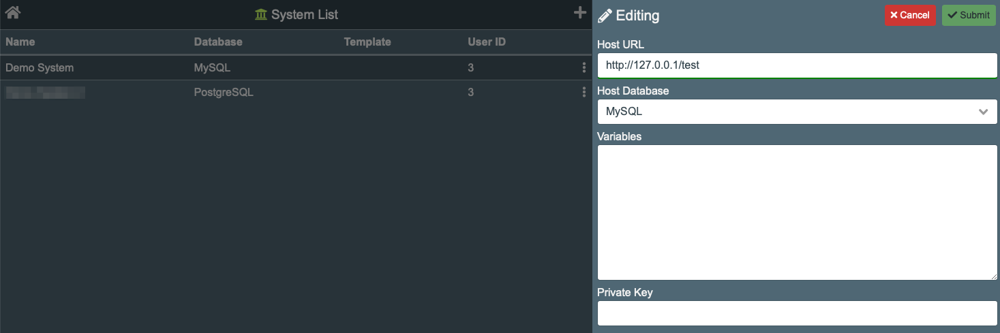
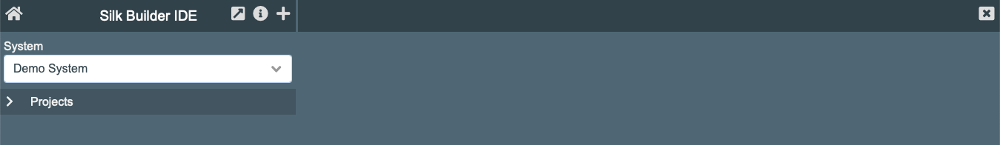
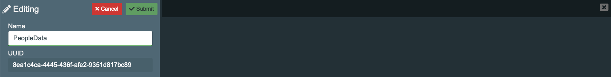

# Development Environment

Development happens in the SilkBuilder web application. To access it you have to have the SilkBuilder url and the account credentials. All this has to be installed and setup by the SILK System Administrator.

### Dashboard

After login in the the SilkBuilder dashboard is displayed. This screen layout changes based on the user's role. The example below show the admin layout.

### Systems

Before start developing applications using SilkBuilder a _System Holder_ has to be created. SilkBuilder is designed to support multiple "Systems". Each "System" works as an applications holder or repository.

Use the "Systems" button located in the SilkBuilder dashboard to setup the systems.

Clicking in the "+" button will open the system editor to add a new system, and clicking the three-dots icon in the extreme left of a row will to edit the information.

A system has the following information:

* **System Name**: The name you want to call your system.
* **Test Database**: This is the database used by SilkBuilder to test the application functionality. Ideally this database should be similar to the SilkClient database. However SilkBuilder support having different databases for the development and productions environment.
* **Template**: The name of the template use for the system. Templates are setup by the SilkBuilder admin. If not entered the system will use the SIlkBuilder template.
* **User ID**: The unique identifier for the _silkUserID_ which will be use a part of the simulated testing process.
* **Menu Link**: If required here goes the URL to the system's menu which is another application.
* **Role List**: A comma separated list of role-name use for the simulated testing process.

### Target Host

A "System" is connected to "Target Hosts" which are web application servers containing the SilkClients environment. Silk builder uses the "Target Host" to deliver a "System" to multiple servers.

After the "System" has been setup the next step is to create a Target Host. A minimal of one Target Host is necessary because SilkBuilder needs to know the target's "Host Database" to properly define the ORM.

A Target Host has the following information:

* **Host URL**: The URL pointing to the SilkClient application server.
* **Host Database**: The database use by the SilkClient.
* **Variables**: To be used to create ORM variable modifications \(Not implemented yet\).
* **Private Key**: Use as authentication token during code upload from SilkBuilder to SilkClient.  

## System's Elements

Once the "System" and the "Target Hosts" has been configured then we are ready to start the _Silk Development_ process. This starts by clicking the _Project_ button in the _Dashboard_ screen which provide access to the **Silk Builder IDE** application.

The screen is divided in two panels. The first one shows the system's elements and the second one is the code container. The "System" combo box allows to move between the different systems and load its elements.

A _System_ hosts _Elements_. An _Element_ is a container of other elements. To add a new _Element_ click on the "**+**" button located in the top-left of the _Silk Builder IDE_ panel. The "**i**" icon allow to open the element editor. Each _Element_ has a UUID which will represent it when it gets deployed to _Silk Clients_.

### Elements

The _System's Elements_ are organized in a pre-define structure which defines how a system and its application gets configured.

#### 1. Project

The _Project_ is the top element on the elements hierarchy. The Project should group applications with similar objective.

The _Project_ hosts the elements: Data Model, Service Poll, and Conceptual Model.

#### 1.1 Data Model

The _Data Model_ element's objective is to define the database model. This can be used to define the interaction with and existing database, or use to create a new database model.

The _Data Model_ elements provide tools to define, setup and document the database. However, the developer could decide to only use it for database communication.

The _Data Model_ hosts the elements: ORM Object, Data Diagram, View Object, Operation Object.

#### 1.1.1 ORM Object

The _ORM Object_ is responsible for the data interaction between the application and the database. The component's long name is "Object Relational Mapping Object". As the name describes the _ORM Object_ objective is to map the relational database table and queries into an object with properties and methods.

#### 1.1.2 Data Diagram

This is not implemented yet but it is planning to show the ORM Objects relationship in a visual diagram.

#### 1.1.3 View Object

The _View Object_ is a code holder for the SQL Create View command. It does not have any operational purpose. This is only necessary for database documentations purposes.

#### 1.1.4 Operational Object

The _Operational Object_ is a code holder for the SQL code which generates triggers, functions, and store procedures. It does not have any operational purpose. This is only necessary for database documentations purposes.

#### 1.2 Service Poll

The _Service Poll_ element's objective is to hosts the applications which will interact with the end user. These could be private application which required user authentication, or public applications which do not require authentication.

The _Service Poll_ hosts the elements: Private App, Private Service, Private Data Outlet, Public App, Public Service, Public Data Outlet, and Email Template.

#### 1.2.1 Private App and Public App

The _Private App_ and the _Public App_ are the code holders of the application displayed to the user. These is where the developer will put the code to design the interaction with the end user.

A _Private App_ will requires user authentication before accessing the application. The _Public App_ will not require authentication.

#### 1.2.1.1 App Module

The _App Module_ helps to fraction the code in small modules for easy code management. These are called from the App using the JSP Include tag: `<jsp:include page="relative URL" flush="true" />` The file URL has to include the .jsp extension.

#### 1.2.3 Private Data Outlet and Public Data Outlet

The _Private Data Outlet_ and _Public Data Outlet_ exist to provide access to the ORM. The functionality of a _Data Outlet_ is to shield the ORM form unwanted access. This provides an extra layer of security by configuring what an application can or can't access from the ORM.

A "Private Data Outlet" requires user authentication to operate. The _Public Data Access_ does not requires authentication.

At execution time the _Data Outlet_ becomes a REST services. This service can be directly accessed by the user, a mobile app, desktop application, or by a web application. By sending the proper JSON structure to the _Data Outlet_, the REST service, the ORM will operate actions in the database. This makes the _Data Outlet_ a dangerous service if not configured properly.

By properly creating and configuring multiple _Data Outlet_ the developer can shield the ORM's functionality and only provide what each user requires. The ORM structure can be very complex but this will never be directly accessible to the end user except by using a _Data Outlet_.

#### 1.2.5 Private Service and Public Service

These are very similar to an App with the difference that these should not provided a user interface but behave like REST service communicating using POST or GET request and returning RAW data like JSON. The _Service_ usually uses JAVA code and will direct access to the ORM file.

A _Private Service_ will require authentication. The _Public Service_ doesn't requires authentication.

#### 1.2.7 Email Template.

An XML structure which defines email content which will be use to communicate with the end user.

#### 1.3 Conceptual Model and Document

These elements are used to create the documentation for the application being developed.

