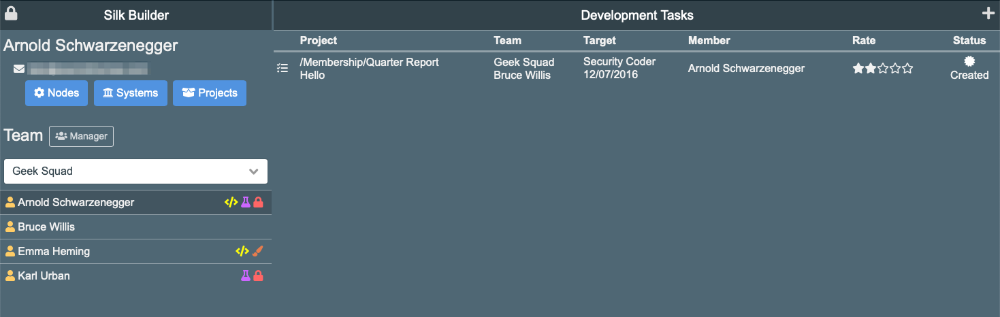
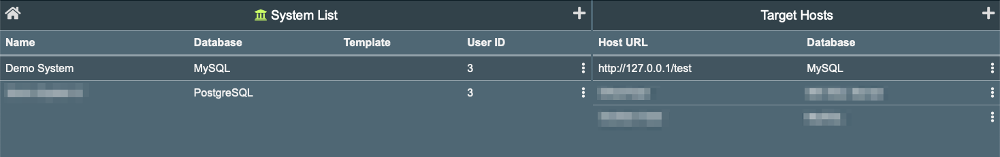
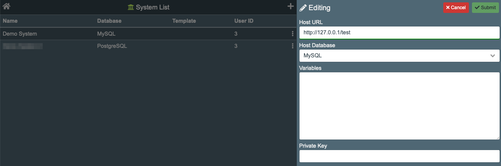

# Development Environment Setup

Development happens in the SilkBuilder web application. To access it you have to have the SilkBuilder url and the account credentials. All this has to be installed and setup by the SILK System Administrator.

## Dashboard

After login in the the SilkBuilder dashboard is displayed. This screen layout changes based on the user's role. The example below show the admin layout.

## Systems

Before start developing applications using SilkBuilder a _System Holder_ has to be created. SilkBuilder is designed to support multiple "Systems". Each "System" works as an applications holder or repository.

Use the "Systems" button located in the SilkBuilder dashboard to setup the systems.

Clicking in the "+" button will open the system editor to add a new system, and clicking the three-dots icon in the extreme left of a row will to edit the information.

A system has the following information:

* **System Name**: The name you want to call your system.
* **Test Database**: This is the database used by SilkBuilder to test the application functionality. Ideally this database should be similar to the SilkClient database. However SilkBuilder support having different databases for the development and productions environment.
* **Template**: The name of the template use for the system. Templates are setup by the SilkBuilder admin. If not entered the system will use the SIlkBuilder template.
* **User ID**: The unique identifier for the _silkUserID_ which will be use a part of the simulated testing process.
* **Menu Link**: If required here goes the URL to the system's menu which is another application.
* **Role List**: A comma separated list of role-name use for the simulated testing process.

## Target Host

A "System" is connected to "Target Hosts" which are web application servers containing the SilkClients environment. Silk builder uses the "Target Host" to deliver a "System" to multiple servers.

After the "System" has been setup the next step is to create a Target Host. A minimal of one Target Host is necessary because SilkBuilder needs to know the target's "Host Database" to properly define the ORM.

A Target Host has the following information:

* **Host URL**: The URL pointing to the SilkClient application server.
* **Host Database**: The database use by the SilkClient.
* **Variables**: To be used to create ORM variable modifications \(Not implemented yet\).
* **Private Key**: Use as authentication token during code upload from SilkBuilder to SilkClient.  

