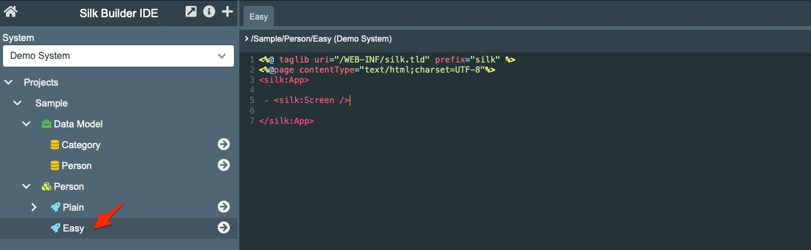

# Easy Application

The 




```xml
<%@ taglib uri="/WEB-INF/silk.tld" prefix="silk" %>
<%@page contentType="text/html;charset=UTF-8"%>
<silk:App>
	
	<silk:Screen>
  	
  </silk:Screen>
	
</silk:App>
```

