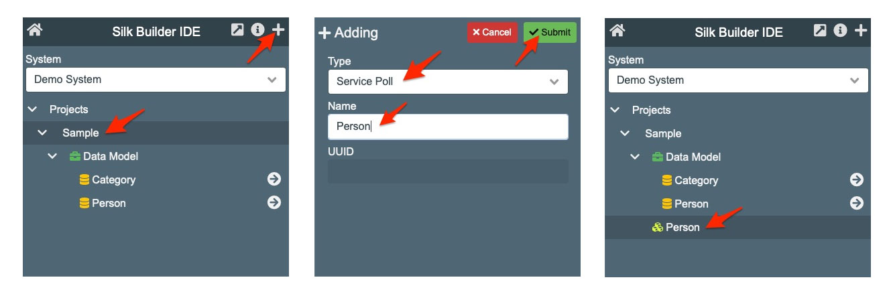
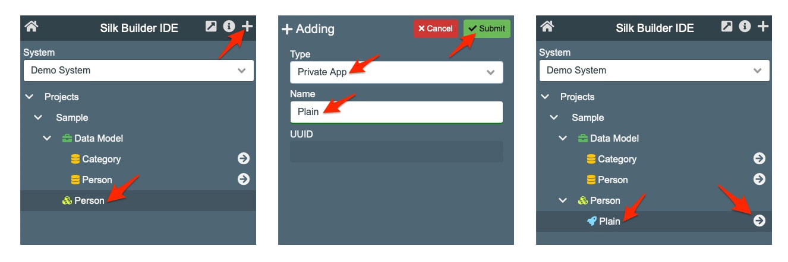
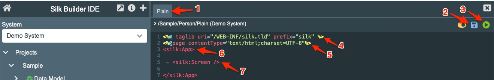
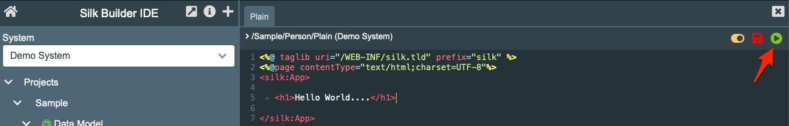
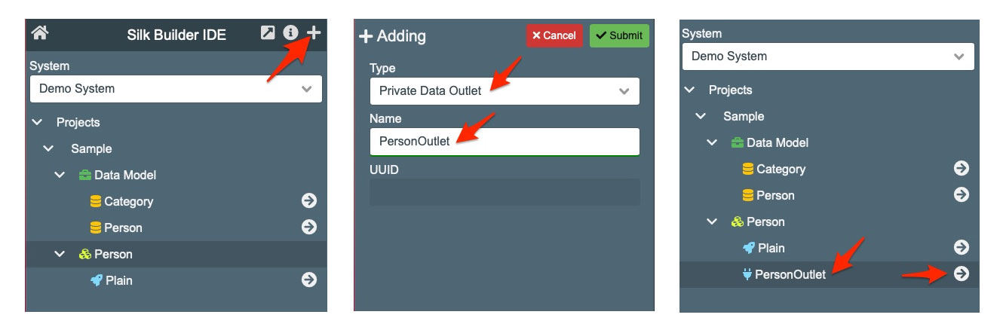
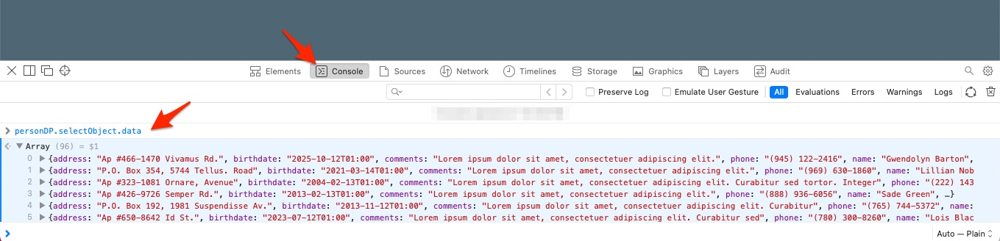
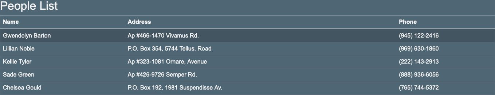

# Plain Application

Before starting the process of building applications using SilkBuilder the development environment should be ready.

* The *System* and the *Project* hosting the application has to be created. Check here for this process [here](development_environment.md).
* If ORM are going to be used to interact with data, these had to be created as well. Check here for this process [here](project_data_model.md).

## The Service Pool

A *Service Pool* is the container for web services. These services can be private or public. A private service is accessible  after authentication. A public service does not requires authentication.

A *Service Pool* can have multiple services which can be private and/or public. It is a good development practice to group related applications under a common *Service Pool*. It is not a advisable to create a *Service Pool* for each application the system needs.

To learn about the different kinds of services check [System Elements](system_elements.md#service-poll) chapter.

To create a *Service Pool* select the *Project* and click on the Plus button at the top right of the frame. Select the type "service Pool", enter the name and click on the Submit button. This service will host the applications related to Person operations.



## Naming Convention

It is recommended to used single words when naming *Service Pools* and *Services*. In the of using multiple words the use of *PascalCase* format is advisable. If multiple words are separated by spaces then the spaces will be replaced by underscore "_" in the service URL.

## The Service URL 

Any service created in SilkBuilder is accessible using URLs which are generated using these formats:

**Private Service**

```
https://[Tomcat_context_path]/service/[Project_Name]/[Service_Pool_Name]/[Service_Name]
```
**Public Service**

```
https://[Tomcat_context_path]/link/[Project Name]/[Service Pool Name]/[Service Name]
```

### The "index" service

If the *Service Pool* has a *Service* named "index" this will be called by default if the [Service_Name] is not included. In this case the URLs would be.

```
https://[Tomcat_context_path]/service/[Project_Name]/[Service_Pool_Name]
https://[Tomcat_context_path]/link/[Project Name]/[Service Pool Name]
```

### Sample URLs

For the "Sample" project the URL to accesses its services will follow this pattern. 

```
https://hostname.com/Sample/Person/[Service_Name]
```

*[Service_Name] no required if the service is named "index".

## The Private App Service

To create a *Private App* select the *Service Pool* and click in the Plus button at the top right of the frame. Select the type "Private App", add the name "Plain" for our sample and click on the "Submit" button. To edit the app click on the arrow-circle icon located at the extreme right of the row. This will open the App Editor.



When the  App Editor tab open you will see these elements: 

1. The editor tab. This will be among other open tabs.
2. The Save button. This button will change to red color when changes had been applied to the code. Clicking on it will save the code into the project.
3. The Run button. This button will execute the application in a new tab. Once the application is open in a new tab refreshing the page will re-run the application.

The first time an *app* is open it will load the default "basic code" to frame an SilkBuilder application. This code contains the following:

4. Calls the *taglib* library. This loads the Silk JSP customs tags used to build SilkBuilder based applications.
5. Sets the page content type to UTF-8 for code text compatibility.
6. The *silk:App* tag which creates the SilkBuilder application wrapper.
7. The *silk:Screen* tag which activates the use pages to layout application.



To create a **plain** application remove the ```<silk:Screen/>``` and add the line ```<h1>Hello World....</h1>``` under the ```<silk:App>``` tag. 



After this click on the Run button and it will open new tab in the navigator with the URL ```https://mydomain/service/Sample/Person/Plain```.


At this level the developer can add more HTML code, stylize using Bootstrap, and use JQuery to add interaction.

## Create a Data Outlet

To display data from a database and application needs access to the [ORM](development/project_data_model)  elements using a [Data Outlet](development/system_elements#private-data-outlet-and-public-data-outlet). The *Data Outlet* exists to provide access control and protection to the ORM. A *Data Outlet* is also a REST service  

To create a *Data Outlet* select the *Service Pool* in which the *Data Outlet* will be created, it is Person in our sample, and click on the plus button at the top right of the panel. In the Adding screen select the type "Private Data Outlet" and enter the name "PersonOutlet". It is recommended that *Data Outlets* names should not have spaces. After this the *Data Outlet* will be added to the *Service Pool*. To configure or edit the *Data Outlet* click on the circle-arrow icon located at the right side of the *Data Outlet* row. 



A *Data Outlet* configuration has these properties:

| Property   | Description                                                  |
| ---------- | ------------------------------------------------------------ |
| ormPath    | This defines the ORM to be accessed                          |
| selectName | Contains the name of a Select or a list of Select's names comma separated  which are going to be accessed. Any other Select configured in the ORM will be ignored if not included in this list. If the selectName property is not included the "default" select name will be used. |

The *Data Outlet* code for our sample would be the following:

```tex
ormPath:Person

```

Enter this code and save it. Make sure that there is an extra line at the end of the code. The *selectName* property is not included because this *Data Outlet* will only use the "default" select.

If the *Data Outlet* is called in the navigator it will return a JSON structure with the records returned by the "default" Select from the Person ORM. You can test this by entering this URL: http://[your-server-here]/service/Sample/Person/PersonOutlet

## Adding a silk:DataProvider

The silk DataProvider tag is used in the SILK Application to interact with Data Outlets. Application can have multiple *DataProviders*.

To add the *DataProvider* to our sample application open the "Plain" Application for editing and add the *silk:DataProvider* tag as showed in the code below.

```xml
<%@ taglib uri="/WEB-INF/silk.tld" prefix="silk" %>
<%@page contentType="text/html;charset=UTF-8"%>
<silk:App>
	
	<silk:DataProvider id="personDP" servicePath="/Sample/Person/PersonOutlet" />
	
</silk:App>
```

The *silk:DataProvider* tag requires at minimum of two properties:

| Property     | Description                                                  |
| ------------ | ------------------------------------------------------------ |
| id           | The unique *DataProvider* identifier. This has to be unique only in the running application. It is recommended to end the name of a *DataProvider* with the postfix "DP" for easy understanding what type of object it is. This will become very useful when creating Javascript functions for extra interaction. |
| servicesPath | This the path to the *Data Outlet* from which the data will be extracted. The root of this path is the project. |

Execute the application by clicking on the "play" button located at the top-left in the screen. The result of the above code  will be an empty page with no  data visible to the user. However, the *silk:DataProvider* will generate a Javascript object with the same name as the *DataProvider's* *id* property. In our sample it will be the called "personDP". If we executed the code ``personDP.selectObject.data`` in the Navigator Javascript console it will show that the application has loaded data from the database and it is currently stored in the "personDP" as an object array. The application has loaded the data but has not been visualized yet.




##Adding a silk:Table

The *silk:Table* tag is a component which interact with the *DataProvider* to visualize data. This component generates an HTML table. It uses the silk:Column tag to define the columns this table will have.

```xml
<%@ taglib uri="/WEB-INF/silk.tld" prefix="silk" %>
<%@page contentType="text/html;charset=UTF-8"%>
<silk:App>
	
  <h2>People List</h2>
  
  <silk:Table id="personList" dataSource="personDP" >
  	<silk:Column title="Name" >{name}</silk:Column>
    <silk:Column title="Address" >{address}</silk:Column>
    <silk:Column title="Phone" >{phone}</silk:Column>
  </silk:Table>
  
	<silk:DataProvider id="personDP" servicePath="/Sample/Person/PersonOutlet" />
	
</silk:App>
```

The *silk:Table* tag requires at minimum of two properties:

| Property   | Description                                                  |
| ---------- | ------------------------------------------------------------ |
| ID         | The unique *Table* identifier. This has to be unique only in the running application. It is recommended to end the name of a *Table* with the postfix "List" for easy understanding what type of object it is. This will become very useful when creating Javascript functions for extra interaction. |
| dataSource | This is the name of the *DataProvider* object which the *Table* will use to render the information. |

The *silk:Column* tag is using the property "title" to set the column title. The *silk:Column* is used to configure the data template defining how the data will be render to the user. In this template the data from the DataProvider is set using "{}" markers.

Executing the application will return a page showing the title "People List" created using the "H2" tag. It will also contain the HTML Table generated by the  *silk:Table* component. The table will highlight the clicked row.



