# Project, Data Model, and ORM

## The Project

The *Project* primary objective is to host *Services*. Before creating *Services* a *Project* as to be first created. It is important to remember that multiple *Services* can be hosted in a *Project*. A *Project* is the best way to group *Services* sharing a common objective.

The project also host the *Data Model* and the *Conceptual Model* elements.

*Projects* are manage inside the Silk Builder IDE. To create on *Project* select the *System* being used, select the projects root element and click on the plus button located at the top right of the frame. Enter the project's name and click on the Submit button.

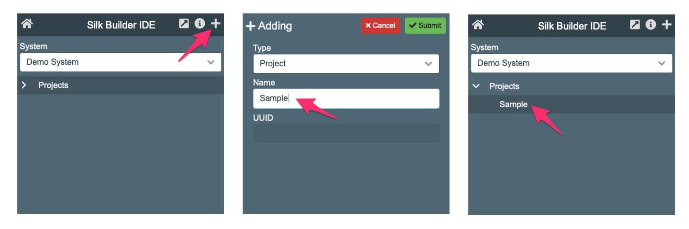

## The Data Model

The *Data Model* hosts the *ORM* element which are use to configure the database access.

To access database objects using the *ORM* element the *Project* has to have at least one *Data Model*. Depending on the complexity of the task a *Project* can have multiple *Data Models* to properly organize and manage the *ORM* elements.

It is possible to create *Services* without a *Data Model*. However these services will not be able to access database objects using the *ORM* elements. On cases like these the developer has take the responsibility to develop its own database connectivity, or use external services to interact with data.

To create a *Data Model* select the *Project*, "Sample" in this case, and click on the plus button at the top right of the frame. For Type select "Data Model" and enter a name. This name helps to "categorize" the *ORM*s. For our sample we will use the name "Data Model" considering that this is a small project. After entering the name click on the Submit button and the *Data Model* element will be added.

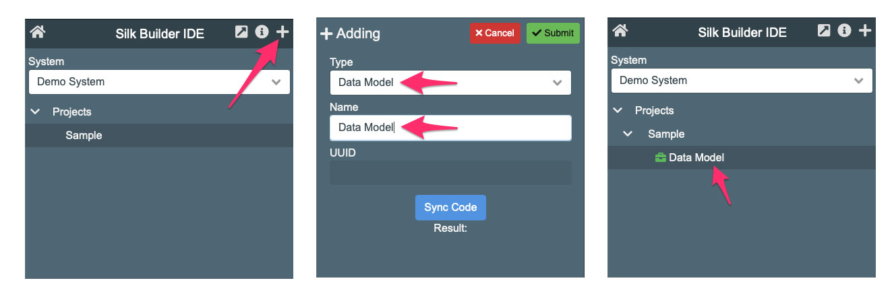 

## Creating the ORM Elements

The Object Relational Model (ORM) element defines the interaction with database Tables. Each ORM is connected to one table to apply insert, updates, and deletes. However the ORM allow to defines selects, triggers, and operations which can affect any table. It is the data modeler responsibility to limit the ORM interaction around the table it represent.

To create a ORM element select a *Data Model* and click in the plus button at the top right of the frame. Select Type "ORM Element" and enter the name which is recommended to be the same as the table the ORM connects. After this click on the "Submit" button.

Four our sample we need to create an ORM for the Person and Category tables.

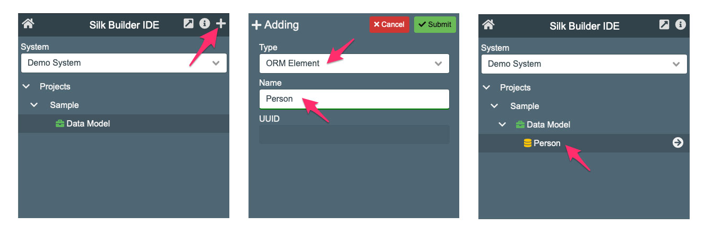

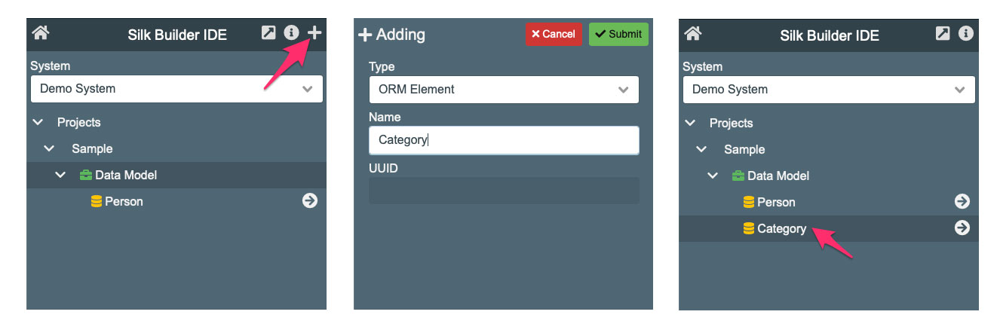

## ORM Configuration for the Category Table

To configure an ORM Element click on the arrow circle located at the right of the ORM element row (a). This will open the ORM Editor in a new Tab (b). 

### Editing Table

Select the "TABLE>" row (c) and click on the edit button located a the top right of the "Table Info" frame (d). This will open the Table editor.

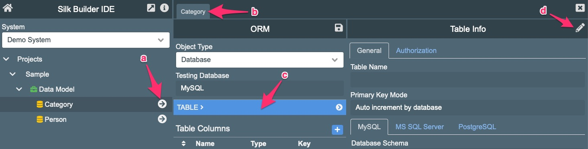

In the Table editor we configure the table which is going to received the ORM action. First you have to enter the "Table Name" as it is in the database (a). Then select the "Primary Key Mode" (b). For our sample this is set to "Auto increment by database". The other options are "SQL Query", "Value Provided", and "UUID auto generated". The next option is  to enter the "Database Scheme" (c). This is use to properly locate the table in the database server.

The ORM can be configured to target multiple database servers (d). This is configured when a *System* gets created. If that is the case an extra tab will be displayed for each targeted database. The first tab will have the database used for testing purposes. On this scenario the data modeler will have to enter the "Database Schema" for each database.

The ORM provides fields to document the data model. The field "Table Description" (e) is used for this purpose. This text will be later combine when the  ORM documentation gets generated.

After the table's information has been entered click on the "Submit" button (f) to save this into the ORM structure.

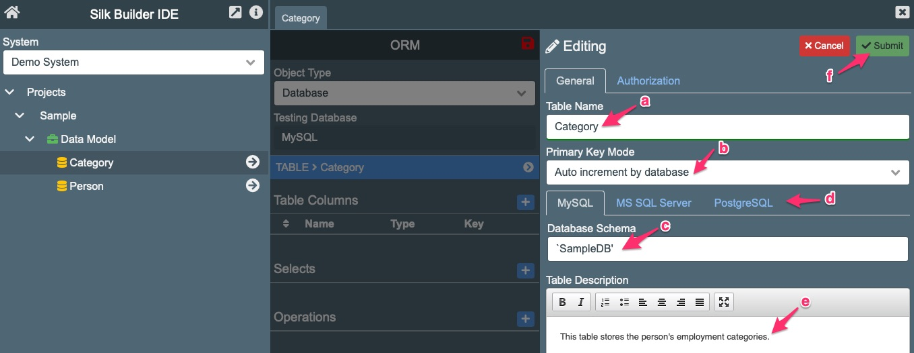

It is important to know that a "Submit" action **only** saves the changes in the ORM structure. You have to click on the ORM save button to permanently save the ORM structure into the project.

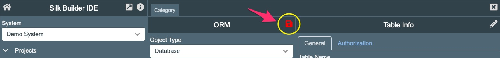

### Adding Columns

To add the table's columns locate the "Table Columns" list (a) and click on the plus button (b). This will open the column's editor.

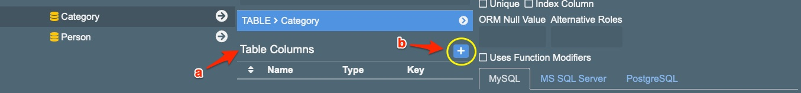

In the column's editor add the "Column Name" (a). Select the "ORM Type" (b) equivalent to the the used database type. SilkBuilder works with these types: String, Integer, Numeric, Date/Time, and Password. For this sample the "Integer" value has been selected. If the columns is the primary key checked the "Primary Key" (c) checkbox.

In the "Database Type" field enter the database type. This could be different for each database. If the ORM is targeting multiple databases enter the type for each database. 

Enter the description text for this column (e) and click on the "Submit" (f) button to save the column into the ORM structure.

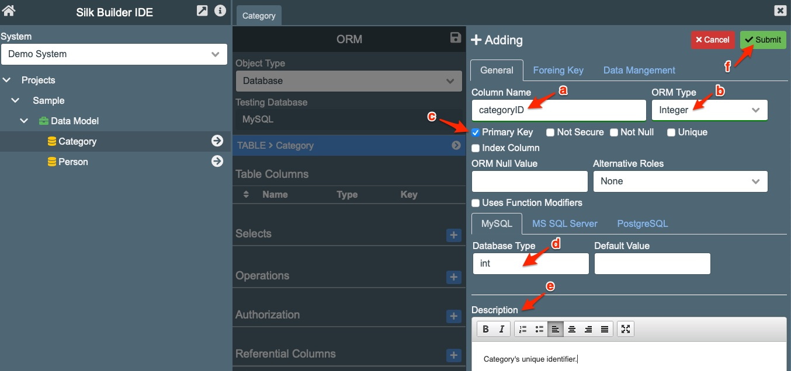

Use the same process to add the "categoryName" columns. In this case the "ORM Type" is going to be "String".

### Adding a Select

The ORM can have multiple Selects configurations. Each one can be created for special purpose and can include other tables if required. 

 To define a "Select" locate the "Selects" (a) list and click on the plus button (b), this will open the Select Editor.


In the Select Editor add the "Select Name" (a). The default select name searched by SilkBuilder is "default" which is used in this sample. Add the "Description" (b) text explaining the select's purpose.

Add the SQL select code (c) which will be used to extract records from the database. If the ORM is configured to target multiple databases this process has to done for each one of databases. Click on the "Submit" (c) button to save the select into the ORM structure.

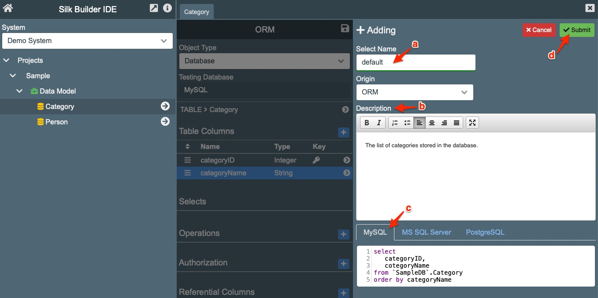

### Generate Table Creation

At the bottom of the ORM Editor are located the options buttons with the following functionality.

* **Doc** : Generates the ORM documentation.
* **XML** : Displays the XML file which is generated internally to load the ORM configuration.
* **SQL** : Generates the Create Table SQL command which can be used to create the table in the database.
* **Exp** : Exports the ORM JSON string which can later be used to generate it.
* **Imp** : Imports a ORM JSON string and generates the ORM data.


### ORM Documentation

Click on the "Doc" button (a) to generate the ORM Documentation. Silk Builder uses the "Description" fields to on this process. 

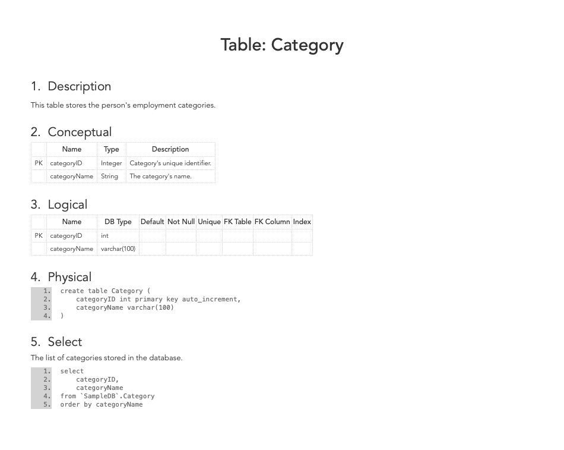

### Create Table SQL

Click on the "SQL" button (a) to generate the Create Table SQL command for the configured table. These code could be used to create the table in the database if these has not been created yet.

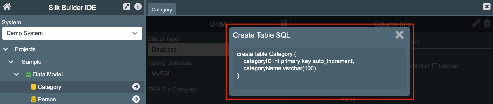

A data modeler ca use the ORMs to generate the SQL script to create its database tables rather than create these manually.

## ORM Configuration for the Person Table

The ORM for the table Person is configured in the same way as the ORM for the table Category. The table name is "Person", it also uses "Auto increment by database", and the database schema is "`SampleDB".

The table below show the columns that need to be added. Don't forget to add the description.

| Column Name   | ORM Type  | DB Type       | Others                            |
| ------------- | --------- | ------------- | --------------------------------- |
| personID      | Integer   | int           | Check "Primary Key"               |
| name          | String    | varchar(100)  |                                   |
| address       | String    | varchar(250)  |                                   |
| phone         | String    | varchar(20)   |                                   |
| email         | String    | varchar(50)   |                                   |
| categoryID    | Integer   | int           | Check "Secure" and "Index Column" |
| married       | Integer   | tinyint       |                                   |
| birthdate     | Date/Time | timestamp     |                                   |
| monthlyIncome | Numeric   | decimal(10,2) |                                   |
| comments      | String    | Text          |                                   |

The extra step is to set the column "categoryID" as a "Foreign Key". For this process click on the "Foreign Key" tab (a) while editing the column. Enter the foreign key table (b) which is "Category" in our sample. Enter the foreign key column (c) which is "categoryID" in our case. There are fields to set the foreign key action. For this case the "FK on Delete" (d) is set to "Set Null". After this you could return to the "General" tab (e) to continue editing the column, or click on the "Submit" button (f) to save the information into the ORM structure. 

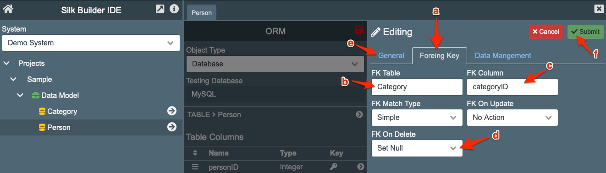

This process is not related to the SilkBuilder functionality. Its objective is to help on the SQL creation and documentation. This change will be showed when the Create Table SQL code gets generated.

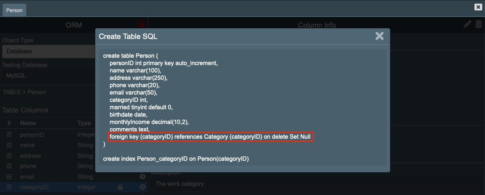

After creating the columns the "default" has to be added. This is the select to be use in the sample.

```sql
select
	p.personID,
	p.name,
	p.address,
	p.phone,
	p.email,
	p.categoryID,
	c.categoryName,
	p.married,
	p.birthdate,
	p.monthlyIncome,
	p.comments
from `SampleDB`.Person p
join `SampleDB`.Category c on p.categoryID=c.categoryID
```

With this the sample data model has been completed.	