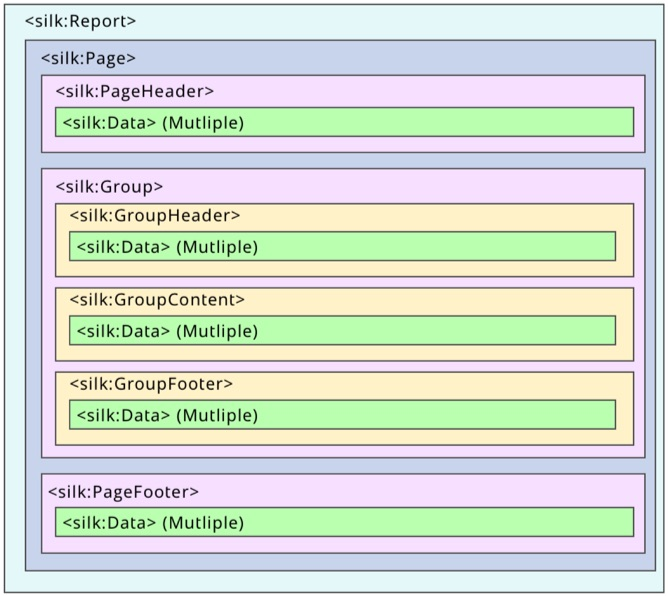
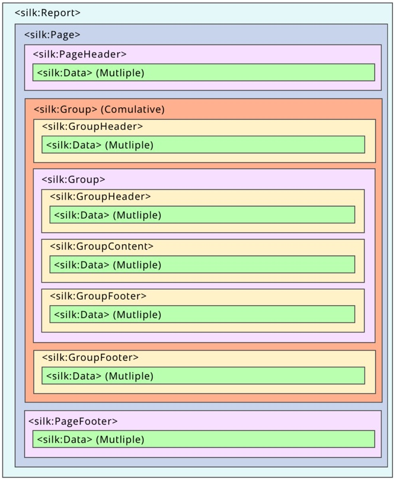

# Report Application

A report in Silk is a specialize application which uses special tags to layout the information on printable reports format. The image below show how these tags are organized to generate a report.

Helllo

sadfd