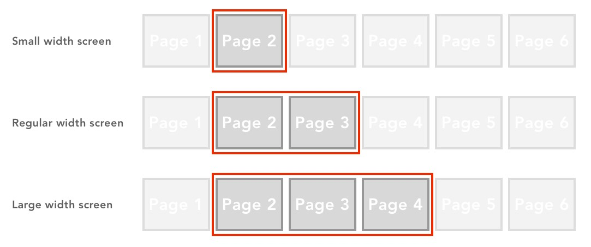

# Development Formats

A SilkBuilder application can be configured to use two different formats: single page and multi page. The only difference is the user of the *silk:Screen*, *silk:Page* and related tags.

## Single Page Format

This is the code required to create an application using the single page format.

```xml
<%@ taglib uri="/WEB-INF/silk.tld" prefix="silk" %>
<%@page contentType="text/html;charset=UTF-8" %>
<silk:App title="" tamplate="" timeout="" >

  ... HTML elements using Bootstrap, Silk Components.

  ... silk:DataProvider components
  
	<silk:JScode>
		... JavaScript code
	</silk:JScode>

	<silk:JQcode>
		... JQuery code
	</silk:JQcode>

</silk:App>
```

A single page application format is a website which grow vertically and its width adapts to the navigator's windows size, or to the device's screen size. The image below shows an example of this type of format.


## Multi Page Format

This is the code required to create an application using the multi page format. Notice that similitude to the single page format except for the use of the *silk:Sceen* and *silk:Page* tags.

```xml
<%@ taglib uri="/WEB-INF/silk.tld" prefix="silk" %>
<%@page contentType="text/html;charset=UTF-8" %>
<silk:App title="" tamplate="" timeout="" >

	<silk:Screen >
		<silk:Page id="" >
    	... HTML elements using Bootstrap, Silk Components. 
    </silk:Page>
    <silk:Page id="" >
    	... HTML elements using Bootstrap, Silk Components.
    </silk:Page>
		.. more pages
	</silk:Screen >

	... silk:DataProvider components

  <silk:JScode>
		... JavaScript code
	</silk:JScode>
  
	<silk:JQcode>
		... JQuery code
	</silk:JQcode>

</silk:App>
```

A multipage page application format is a website in witch the information is distributed on panels (columns or pages). The panels are be configured to be display in different arrangements depending on the navigator's window width, or the device's screen width. In a mobile phone the user may see only one panel and will be lead to other individual panels by interacting with the application. However in a big screen the user may see all the panels are once. The image below shows an example of this type of format.


## Page Layout

When using a Multi Page Format application SilkBuilder organizes the pages in a single row array distribution. Each page could be consider a cell in a single row table. The pages are added to the list in the order these are placed in the application code.


To display the pages in the navigator's window Silk Builder uses the *silk:Page* **Layout attributes' values and the "width" of the host window to decide what pages will be shown and which will be hidden. These could be from just one pages in mobile devices or to multiple pages in a desktop computer window. This kind of behavior is shown in the image below.



For the user each page would look like a "columns". It is the developers responsibility to plan how the pages will be displayed to the end user, this taking into consideration all the possible windows widths. To facilitate the application flow it is possible to hide pages between active pages. In the example below the user will always see only two pages or "columns". In the "page 2" will be located in the "first column" and it will look like "static", while in the "second column" the user will se "page4" and "page5" switching.


### Layout Properties

This list shows the available layout properties and the window's width which triggers when it will be used.

| Name     | Description      | Width     |
| -------- | ---------------- | --------- |
| smLayout | Small Size       | < 544px   |
| mdLayout | Mid Size         | <= 768px  |
| rgLayout | Regular Size     | <= 1024px |
| lgLayout | Large Size       | <= 1400px |
| xgLayout | Extra Large Size | <= 1900px |
| xxLayout | Extrem Size      | > 1900px  |

When a page gets focused, or becomes "active", the data in the layout property commands how the pages will be displayed. When another page gets focused, then that particular page layout property takes the pages distribution authority. This allows the developer to have full control of pages behavior.

### Layout Template

The layout properly requires data in a special format. This format uses the *silk:Page* stage attribute information to refer to the target page. The recommendation is to keep the names the "stage" attribute as short as possible. A single character or a dual character. The "stage" name is used to easy the layout configuration process, and if necessary to be able to change the page ID anytime without needing to re-configure the page's layout information.

The template value is a string containing page "configuration blocks". These could be one block, or multiple blocks separated by commas. A block format has these 3 components separated by semicolons ":". These components are: 

| Component | Description                                                  |
| --------- | ------------------------------------------------------------ |
| Stage     | The stage name of the target page.                           |
| Width     | The width of the page.  This is not required. The expected value are "*" (fill available space) or pixel number, example "400px". If not included the default values is " * ". If the "Back button" will be used then "With" has to be included. |
| button    | The button to show. this is not required. Currently the only value is "b" and it will show the default "back button" |

The list below show samples on how to use the components  to create a configuration block, and layout templates.

| Sample Format       | Description                                                  |
| ------------------- | ------------------------------------------------------------ |
| A                   | One page will be shown. A page with stage name "A" will be visible with "*" (fill available space) as width and no back button. |
| A:500px             | One page will be shown.A page with stage name "A" will be visible with a width of "500px" and not back button. |
| A:500px:b           | One page will be shown.A page width stage name "A" will be visible width a width of "500px" and will show the back button. |
| A,B:400px           | Two pages will be showed. The first one has "A" as stage name, "*" as width, and no back button. The second page has "B" as stage name, "400px" width, and will not show a back button. |
| A:500px,C:*:b       | Two pages will be showed. The first one has "A" as stage name, "500px" width, and no back button. The second page has "C" as stage name, "*" as width, and will show a back button. |
| A:500px,B:*,C:600px | Three pages will be showed. The first one has "A" as stage name, "500px" width, and not back button. The second  page has "B" as stage name, "*" as width, and not back button. The third page has "C" as stage name, "600px" width, and not back button. |

### Layout Examples

```xml
	<silk:Page id="filterListPage" stage="F1"
		smLayout="F1"
		mdLayout="F1"
		rgLayout="F1:400px,A1"
		lgLayout="F1:400px,A1"
		xlLayout="F1:400px,A1:500px,B1"
		xxLayout="F1:500px,A1:600px,B1"
	>
```

