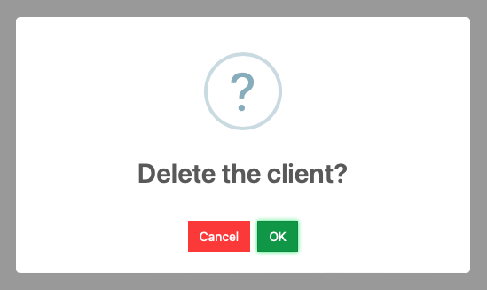
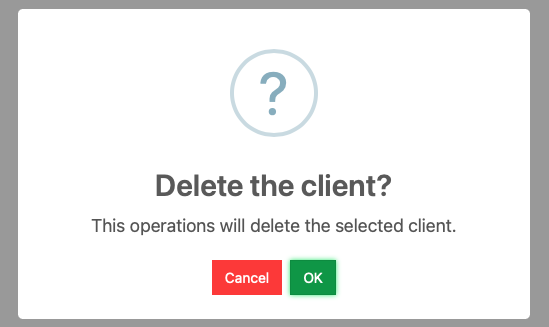
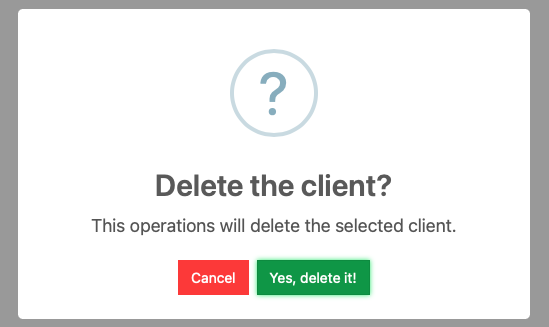
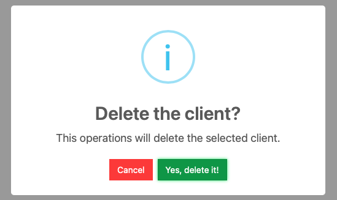

# Button with Confirmation

The *silk:Button* component contains the option to display a confirmation dialog window before triggering the "click" event. The user will use the dialog window to confirm the button's action. The confirmation process uses the library [sweetalert2](https://sweetalert2.github.io/) to display the dialog window with two buttons to click: one button to cancel and another to confirm. By default, the confirmation button shows the "OK" label.

The code below shows the silk tag using the confirmation properties.

```xml
<silk:Button id="bt1" label="Click me"
	confirmTitle=""
	confirmMessage=""
	confirmLabel=""
	confirmIcon=""
/>
```

It is optional to use all the properties at once; it is enough to use one property to activate the dialog windows or more properties if required.

## Properties

| Property       | Description                        | Default Value         |
| -------------- | ---------------------------------- | --------------------- |
| confirmTitle   | The confirmation's dialog title.   | The text  "Continue?" |
| confirmMessage | The confirmation's dialog message. | Empty                 |
| confirmLabel   | The confirmation's button's label. | The test "OK".        |
| confirmIcon    | The confirmation's dialog icon     | The value "question". |

## Example 1

The next is an example of setting the property confirmation's title as  "Delete the client?" and leaving the other properties as default.

```xml
<silk:Button id="bt1" label="Delete"
	confirmTitle="Delete the client?"
/>
```



## Example 2

The example now adds a message to the dialog window.

```xml
<silk:Button id="bt1" label="Delete"
	confirmTitle="Delete the client?"
	confirmMessage="This operations will delete the selected client."
/>
```



## Example 3

This code expands to the previous example and changes the confirmation button to "Yes, delete it!".

```xml
<silk:Button id="bt1" label="Delete"
	confirmTitle="Delete the client?"
	confirmMessage="This operations will delete the selected client."
	confirmButton="Yes, delete it!"
/>
```



## Example 4

And finally, the default icon is changed to "info."

```xml
<silk:Button id="bt1" label="Delete"
	confirmTitle="Delete the client?"
	confirmMessage="This operations will delete the selected client."
	confirmButton="Yes, delete it!"
  confirmIcon="info"
/>
```


