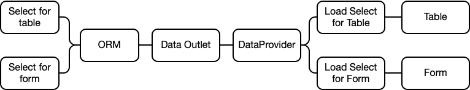

# Record Sync

In a regular data-display process a *silk:DataProvider* is used to retrieve a list or records from a *SQL Select* command configured in a ORM. Then columns from the returned records will be displayed in a *silk:Table* list. A *silkForm* will be used display the columns in a form format to be shown or edited. In this process each record that is going to be displays or edited is contained in the *silk:DataProvider*. 


## Bulk Loading

Considering a select which returns 400 records with 6 columns the data return  will contain a long grid of 2,400 cells. If most of the 6 columns are going to be displayed in the *silk:Table* and the *silk:Form* then extracting all this data is reasonable.

However, if the list will only show 2 columns then extracting the full data, 2,400 cell, may not be the best scenario. To display the table data we only need to have 800 cell (400 rows x 2 columns) which is 60% less data.

A sample of 400 records may not seen dramatic. However if the process requires to retrieve a *select* of 2,500 records with 30 columns then any optimization processes is welcomed.

## Optimized Loading

The ideal and efficient way would be for the *silk:DataProvider* to return the 400 records from our example only containing the 2 necesary columns for the Table. This will result in only 800 data cells.

But, what about the other columns needed by *silk:Form*? 

The solution for this is to retrieve these extra columns only when the form needs these. This regularly happens when the user clicks on a list's row and the *silk:Form* gets populated.

For this to happen we have to use two *selects*. One returning the columns for the table, and another returning the extra columns only for the selected record.



## Record Sync Process

SILK Provides a process to use two *select*s to manages data. One *select* to fill a table, and another to sync extra records needed for a form.

The *silk:DataProvider* will use one *select* to load the record list. When extra records will be needed the second *select* will be used to retrieve the extra columns will be added to the alrady loaded record.

## The ORM Configuration

To support record syncing an extra *select* has to be added to the ORM. This new select will have the same names as the *select* for the record list but adding the ending "-recordSync". Below is an example of the two selects.

```XML
<sqlSelect name="list" >
	<![CDATA[
		select
			personID,
			name,
			address,
			email
		from testPerson
	]]>
</sqlSelect>

<sqlSelect name="list-recordSync" >
	<![CDATA[
		select
			personID,
			phone,
			monthlyIncome
		from testPerson
		where personID = $P{personID}
	]]>
</sqlSelect>
```

The recordSync *select* has to return only the record to synchronize and include the table's primary key.

If using the SilkBuilder these *selects* will be added using the IDE interface.

## The silk:DataProvider

In the *silk:dataProvider* tag the property "selectName" is set to the name of *select* which will load the records for the table, and the property *recordSync* as to be set to "true".

```xml
<silk:DataProvider id="personDP" servicePath="/--/--/outlet" selectName="list" recordSync="true" />
```

The method *beforeRecordSync* is used to configure the parameters need to execute the *select* returnig the extra columns.

```javascript
personDP.on("beforeRecordSync",function(){
  personDP.setParameter("personID","<the personID value here>");
});
```

## The silk:Table and silk:Form

There are not change needed for the *silk:Table* or *silk:Form*. When the user clicks on a table row the *recordSync* process will be executed and after the new coumns had been added the *silk:Form* will be refreshed to show newly added records data.

## The recordSync method

If the *silk:DataProvider* is being used alone or with other components and is also configured with ```recordSync="true"``` then the mothod *recordSync* can be executed to retrieve the extra columns. In this case the property *seletedIndex* has to be setup to point at the target record.

```javascript
personDP.selectedIndex = 10;
personDP.recordSync();
```

