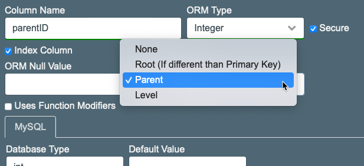
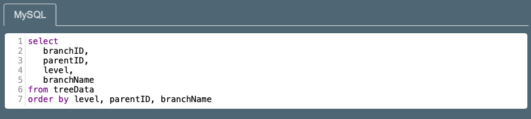
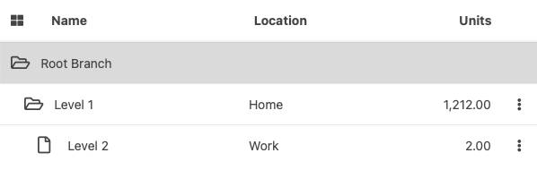
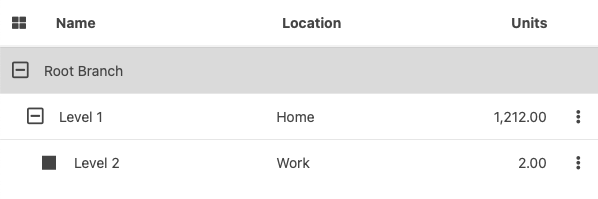

# Data Trees

Data trees are a visual representation of hiearchical information. This will have a root branch which could contain multiple branches and sub-branches.

## Data Requirements

To display a tree using SILK it is required for each record, or branch, in the table to have these information:

- The branch's unique identifier. Usually this is the record's primary key.
- The parent's unique identifier. It will be empty for the root branch.
- The level. Even though the level can be determine by analysing the parental connection, SILK requires for this to exist in the database to faciliate the tree management. The level does not need to start in zero (0) but has to increase as the branches go deeper.

A sample of a table storing a data tree will have this basic structure (mySQL):

```sql
create table treeData (
	branchID int primary key auto_increment,
  parentID int,
  level tinyint,
  branchName varchar(100)
);
create index treeData_parent on treeData(parentID);
```

## The ORM

The ORM provides properties to indicate the "role" the selected columns will play in a data tree configuration. The ORM can host regular selects and data tree selects. The data tree selects have to have the same role columns configured in the ORM.

If the configuration happens directly in the ORM XML the properties to use are: "root", "parent", and "level". These properties can received teh value "true" or "1" to be activated. A column can only have one of these roles.

In the sample below the properties "parent" and "level" are being used. The property "root" is not being used. The "root" property is used to mark the non-primery-key column which holds the brach unique identifier.

```xml
<table name="treeData" >
	<column name="branchID" type="I" pk="1" />
	<column name="parentID" type="I" secure="1" parent="1" />
	<column name="level" type="I" level="1" />
	<column name="branchName" type="S" />
</table>
```

When using the SilkBuilder interface the columns' configuration provides the option "Alternative Roles" which has the options:

- None
- Root (If different that Primary Key)
- Parent
- Level



## The Select

When creating a select for a data tree it is important to include the columns defined as root (pk), parent, and level. Also the table has to be ordered first by level and then by the parent, after this any other ordering can be included.

Below is an example if editing the XML direclty. 

```xml
<sqlSelect >     
	<![CDATA[
		select
			branchID,
			parentID,
			level,
			branchName
		from treeData
		order by level, parentID, branchName
	]]>
</sqlSelect>
```

When using the SilkBuilder the "select" has to be added using the ORM user interface.



The order by "level" is important because the first level is considered the root branch. Ideally the data tree should have only one root, however, it is posible to have multiple records in the top level.

Ordering by parent helps on post processing performance. The SQL does not return a tree structure but a linear list or records order by level. After the select has been downloaded then the client will processes it into a hiearchical information searching for the children using the parent column.

## The ROOT branch

A table configured as a data tree will need to be initialize with the first records as the root branch in the database. This will usually be in the level zero (0). It is from this root branch which other branches will be created. The root branch is usually never edited.

In some cases the the table will not contain the root branch. This is the case when the table uses a foreing key. In this case the root branch has to be visible regardles of what foreing key is beign used to filter the data. For this cases is better to add the root record as a "union" to not be afected by the foreing key filtering.

```sql
select
	0 as branchID,
	0 as parentID,
	0 as level,
	'root' as branchName
union
select
	branchID,
	parentID,
	level,
	branchName
from treeData
where fkColumn=12
order by level, parentID, branchName
```

Another way to add the root branch is by using the *silk:DataProvider* event *processLoadedData*.

```javascript
treeDP.on("processLoadedData",function(returnObject){
  var rootItem = new Object();
  rootItem["branchID"] = 0;
  rootItem["parentID"] = 0;
  rootItem["level"] = 0;
  rootItem["branchName"] = "root";
  
  return returnObject.data.unshift(rootItem);
});
```

This method is limited only to the application in which it is implemented. This method is not convenient if the tree is going to be used in multiple application. Also, if  the select returns a large amount of records this method adds an extra processing step. This method can also create conflict with encripted columns.

## The silk:DataProvider

The *silk:DataProvider* has the property *treeData* which has to be set to "true" to process data trees.

```xml
<silk:DataProvider id="treeDP" servicePath="/--/--/" treeData="true" />
```

Any other configuration is similar to a regular select processing.

## The silk:Table tag

From the *silk:Table* configuration there is not much change. Visually the data will be layout in a tree distribution.



The sample shows the default icons. To change the icons you can use the *iconClose*, *iconOpen*, and *iconEmpty*.

```xml
<silk:Table id="treeList" dataSource="treeDP"
	iconOpen="far fa-minus-square fa-lg" iconClose="far fa-plus-square fa-lg" iconEmpty="fas fa-square-full"
>
```

It is also posible to change the icons using JavaScript.

```javascript
treeList.setTreeIcons("far fa-minus-square fa-lg", "far fa-plus-square fa-lg", "fas fa-square-full");
```

The sample below show the tree with the custom icons.



With the properties *rootLabel* it is possible to add a custom root label overwriting the name return by the database. This is specially useful for translation when the root branch is not part of the database.

By default the tree is displayed with all the branches open or uncollpated. Using the property *collapsedLevel* it is possible to configure from which level the branches will initially be collapsed.

Apart from these configurations tree related the *Table* functionalty remain the same.

## The silk:Form tag

The only difference with the *silk:Form* functionality when editing trees is that the *insert* will add a new child branch to the selected branch. Apart of of this the configuration and functionality remains the same.

