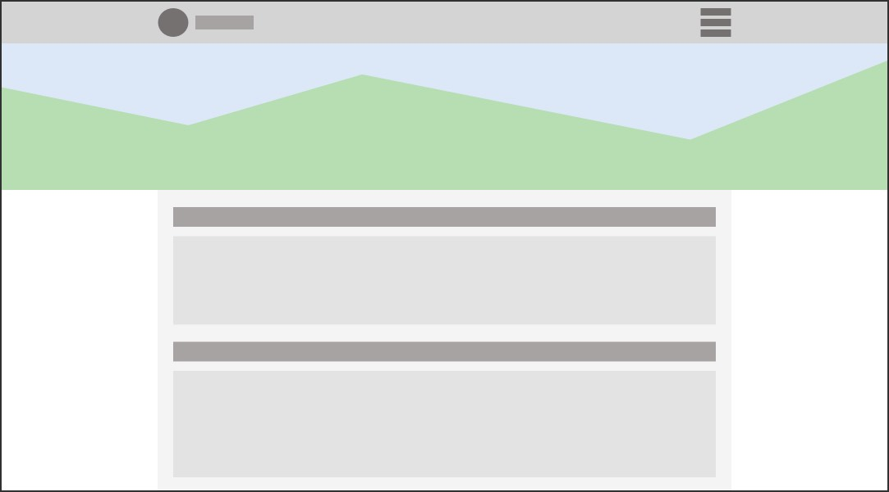
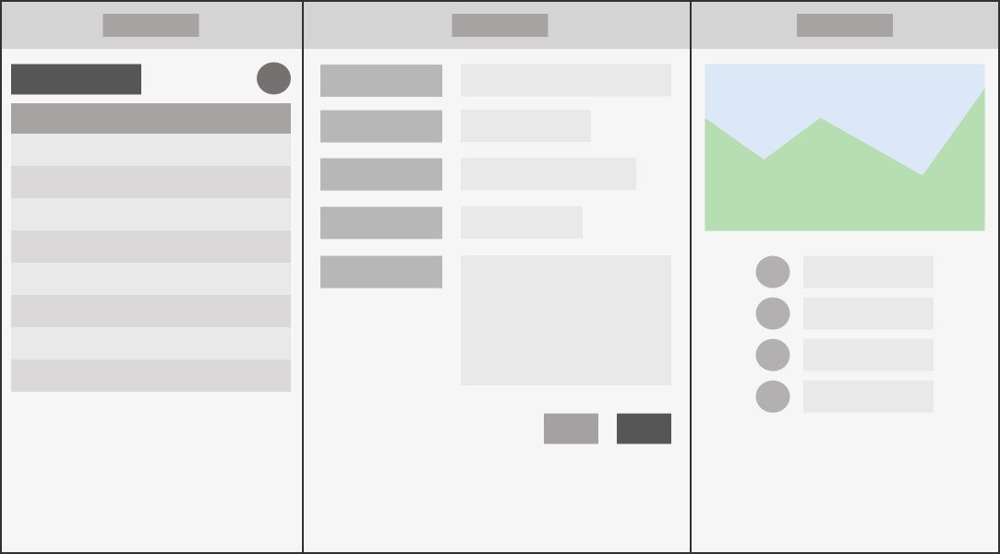
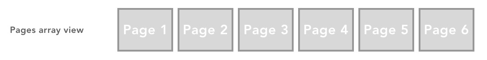
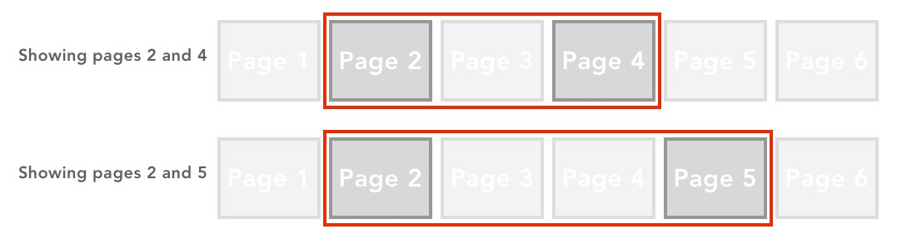

# Silk Application Tags

## App tag `<silk:App>`

The *silk:App* tag defines a Silk Application and its used is required.  This tag loads the application's environment which is necessary for the other Silk Components to operate. 

```xml
<%@ taglib uri="/WEB-INF/silk.tld" prefix="silk" %>
<%@page contentType="text/html;charset=UTF-8" %>
<silk:App title="" template="" timeout="" role="" >
	...
</silk:App>
```

### Properties

| Name     | Description                                                  | Default   | Required |
| -------- | ------------------------------------------------------------ | --------- | -------- |
| title    | Used to define the web page title which will be displayed by the navigator. | empty     | No       |
| template | The name of the template defining the styles use by the components. This property is only necessary if the application will use a different template from the "default" one which define globally and automatically loaded by the application. | "default" | No       |
| timeout  | Defines if the application will timeout and request for authentication. The default value is "true" and it can be disable by setting property to "false". It is only required if the value will be set to "false". | "true"    | No       |
| role     | Set the roles which are authorize to run the application. It should contain a list of string values separated by commas. These roles will be checked against the user's roles loaded at authentication time. By default it is empty which allows access to anyone log in. The validation process only happens if a value is provided. | empty     | No       |

After setting the *silk:App* tag the developer has two options:

1. Use *silk:Pages* to layout the application. For this the *silk:Screen* tag is required. This is a "multi page" format.
2. If the application will not use *silk:Pages* then it if ready to received Silk Components in a "single page" format.

## AppHeader tag `<silk:AppHeader>`

This tag should be used only if it becomes necessary to add data into the  `<header>` part of the HTML page on a particular application. If the code will apply for all applications then this should be added in the default template. 

```xml
<silk:AppHeader>
	...
</silk:AppHeader>
```

## Screen tag `<silk:Screen>`

This tag is used to defined the use of *sik:Page* tags to organize the application's Silk Components using responsive panels. This call "multi page" format. Without this tag the application will work as a "single page" format.

```xml
<silk:Screen>
	... Pages tags goes
</silk:Screen>
```

##  JScode tag `<silk:JScode>`

This tag is used to add JavaScript code in the application.  SilkBuilder will collect all the JavaScript code and put them together regardless of where these had been defined. This is the code which has to be executed  before JQuery is active and accessible by the application. These can be setting global variables and/or functions.

```xml
<silk:JScode>
    ... JavaScript code
</silk:JScode>
```
##  JQcode tag `<silk:JQcode>`

This tag is use to add JQuery code in the application. SilkBuilder will collect all the JQuery code and put them together regardless of where these had been defined. The Silk Components uses JQuery to interact with HTML elements. Code to interact with the SILK Components should be define under this tag.

```xml
<silk:JQcode>
    ... JQuery and Silk Components interaction code
</silk:JQcode>
```
# Application Format

A SilkBuilder application can be configured to use two different formats: single page and multi page. The only difference is the user of the *silk:Screen* and *silk:Page* and related tags.

## Single Page Format

This is the code required to create an application using the single page format.

```xml
<%@ taglib uri="/WEB-INF/silk.tld" prefix="silk" %>
<%@page contentType="text/html;charset=UTF-8" %>
<silk:App title="" tamplate="" timeout="" >

  ... HTML elements using Bootstrap, Silk Components.

  ... silk:DataProvider components
  
	<silk:JScode>
		... JavaScript code
	</silk:JScode>

	<silk:JQcode>
		... JQuery code
	</silk:JQcode>

</silk:App>
```

A single page application format is a website which grow vertically and its width adapts to the navigator's windows size, or to the device's screen size. The image below shows an example of this type of format.



## Multi Page Format

This is the code required to create an application using the multi page format. Notice that similitude to the single page format except for the use of the *silk:Sceen* and *silk:Page* tags.

```xml
<%@ taglib uri="/WEB-INF/silk.tld" prefix="silk" %>
<%@page contentType="text/html;charset=UTF-8" %>
<silk:App title="" tamplate="" timeout="" >

	<silk:Screen >
		<silk:Page id="" >
    	... HTML elements using Bootstrap, Silk Components. 
    </silk:Page>
    <silk:Page id="" >
    	... HTML elements using Bootstrap, Silk Components.
    </silk:Page>
		.. more pages
	</silk:Screen >

	... silk:DataProvider components

  <silk:JScode>
		... JavaScript code
	</silk:JScode>
  
	<silk:JQcode>
		... JQuery code
	</silk:JQcode>

</silk:App>
```

A multipage page application format is a website in witch the information is distributed on panels (columns or pages). The panels are be configured to be display in different arrangements depending on the navigator's window width, or the device's screen width. In a mobile phone the user may see only one panel and will be lead to other individual panels by interacting with the application. However in a big screen the user may see all the panels are once. The image below shows an example of this type of format.



# The Page

## Page tag `<silk:Page>`

In a multi page format application the *silk:Page* tag is used to define the panels (columns) the application will use to place the Silk Components. This tag is part of the Silk Components but is being listed here because of its importance on the application layout and interaction.

```xml
<silk:Page id="" stage="" returnPage=""
    smLayout=""
    mdLayout=""
    rgLayout=""
    lgLayout=""
    xlLayout=""
    xxLayout=""
>
	...
</silk:Page>
```
### Properties

| Name                                                        | Description                                                  | Default | Required |
| ----------------------------------------------------------- | ------------------------------------------------------------ | ------- | -------- |
| id                                                          | The unique page identifier. No other component should use this name. A JavaScript object will be created with the same id name for code interaction. | empty   | Yes      |
| stage                                                       | A short name (A, B, A1, B1) which will be used with the layout properties to define pages behavior. | empty   | Yes      |
| returnPage                                                  | The id of the page to-go when the user clicks on the return "<" icon. This is only necessary if the return page is not the immediate left-located page. | empty   | No       |
| smLayout, mdLayout, rgLayout, lgLayout, xlLayout,  xxLayout | These properties define how the page will interact with other pages when the view port width changes. Each one targets a different view port width size. More explanation on how to use these properties are found in the Page Layout part. | empty   | Yes      |

### The Page Object

When using the *silk:Page* tag SilkBuilder will generate a JavaScript object which can be used to interact with the "page" programatically. This object has  the same name as the page ID.

### Attributes

| Name        | Description                                                  |
| ----------- | ------------------------------------------------------------ |
| id          | The page identifier.                                         |
| $page       | A JQuery object to the "div" tag wrapping the page.          |
| $content    | A JQuery object the "div" tag containing the page content.   |
| stage       | The stage name used by the page                              |
| layout      | An array with the different layout profiles for the page. Each item stores one of the layout profiles: 0=smLayout, 1=mdLayout, 2=rgLayout, 3=lgLayout, 4=xlLayout, and  5=xxLayout. |
| width       | The selected marker from the layout array which is being used to set the page's width. This will change based on the navigator or device screen width. |
| masked      | A boolean indicating if the page has been masked. It returns "true" if the page is masked, and "false" if it is not. A page is masked when a form is on editing mode. |
| index       | The index position in the pages list. Zero (0) is the first element. |
| $backButton | A JQuery object to the page's back button.                   |
| isSingle    | A boolean indicating if the page is the only element in the screen. It return "true" is the page is the only one displayed. This is mostly the case when using the application on mobile devices. However the user decides this behavior using the layout properties. |
| headerWidth | Deprecated                                                   |
| tabsNav     | Returns the *silk:TabNav* which the page is using to be displayed. |

### Methods

| Name            | Description                                                  |
| --------------- | ------------------------------------------------------------ |
| getID()         | Returns the page identifier.                                 |
| resize()        | Forces a resize operation.                                   |
| show()          | Set the page as the "active". The active page will the the visualization priority and its "layout" properly will be use to decided the other related pages distribution. |
| mask(mode)      | Masks the page if the parameters is "true", or unmask the page if the parameters is "false". Masking a page creates a darker layer on other pages to limit interaction to only the selected page. This is the status when editing a form. |
| maskProcess()   |                                                              |
| goBack()        | Focuses the page configured using the tag property "returnPage". Otherwise it focuses the previous page in the pages list. This function uses the property "index" to find the previous page (index-1). |
| setTitle(title) | Sets the pages title. The parameter is the new page title. This only works if the page is using the *silk:Head* tag. |
| getTitle()      | Return the page title. This only works if the page is using the *silk:Head* tag. |
| initPage()      | Initialized the page object. This is automatically executed during the application initialization. This could function could be used if a page is added at runtime and needs to be initialized. |

### Events

| Name   | Description                                                  |
| ------ | ------------------------------------------------------------ |
| onShow | A function which will be be executed after the page become on focused or shown. |
| onHide | A function which will be be executed after the page stops being on focused or hide. |


## Page Layout

When using a Multi Page Format application SilkBuilder organizes the pages in a single row array distribution. Each page could be consider a cell in a single row table. The pages are added to the list in the order these are placed in the application code.



To display the pages in the navigator's window Silk Builder uses the *silk:Page* **Layout attributes' values and the "width" of the host window to decide what pages will be shown and which will be hidden. These could be from just one pages in mobile devices or to multiple pages in a desktop computer window. This kind of behavior is shown in the image below.


For the user each page would look like a "columns". It is the developers responsibility to plan how the pages will be displayed to the end user, this taking into consideration all the possible windows widths. To facilitate the application flow it is possible to hide pages between active pages. In the example below the user will always see only two pages or "columns". In the "page 2" will be located in the "first column" and it will look like "static", while in the "second column" the user will se "page4" and "page5" switching.



### Layout Properties

This list shows the available layout properties and the window's width which triggers when it will be used.

| Name     | Description      | Width     |
| -------- | ---------------- | --------- |
| smLayout | Small Size       | < 544px   |
| mdLayout | Mid Size         | <= 768px  |
| rgLayout | Regular Size     | <= 1024px |
| lgLayout | Large Size       | <= 1400px |
| xgLayout | Extra Large Size | <= 1900px |
| xxLayout | Extrem Size      | > 1900px  |

When a page gets focused, or becomes "active", the data in the layout property commands how the pages will be displayed. When another page gets focused, then that particular page layout property takes the pages distribution authority. This allows the developer to have full control of pages behavior.

### Layout Template

The layout properly requires data in a special format. This format uses the *silk:Page* stage attribute information to refer to the target page. The recommendation is to keep the names the "stage" attribute as short as possible. A single character or a dual character. The "stage" name is used to easy the layout configuration process, and if necessary to be able to change the page ID anytime without needing to re-configure the page's layout information.

The template value is a string containing page "configuration blocks". These could be one block, or multiple blocks separated by commas. A block format has these 3 components separated by semicolons ":". These components are: 

| Component | Description                                                  |
| --------- | ------------------------------------------------------------ |
| Stage     | The stage name of the target page.                           |
| Width     | The width of the page.  This is not required. The expected value are "*" (fill available space) or pixel number, example "400px". If not included the default values is " * ". If the "Back button" will be used then "With" has to be included. |
| button    | The button to show. this is not required. Currently the only value is "b" and it will show the default "back button" |

The list below show samples on how to use the components  to create a configuration block, and layout templates.

| Sample Format       | Description                                                  |
| ------------------- | ------------------------------------------------------------ |
| A                   | One page will be shown. A page with stage name "A" will be visible with "*" (fill available space) as width and no back button. |
| A:500px             | One page will be shown.A page with stage name "A" will be visible with a width of "500px" and not back button. |
| A:500px:b           | One page will be shown.A page width stage name "A" will be visible width a width of "500px" and will show the back button. |
| A,B:400px           | Two pages will be showed. The first one has "A" as stage name, "*" as width, and no back button. The second page has "B" as stage name, "400px" width, and will not show a back button. |
| A:500px,C:*:b       | Two pages will be showed. The first one has "A" as stage name, "500px" width, and no back button. The second page has "C" as stage name, "*" as width, and will show a back button. |
| A:500px,B:*,C:600px | Three pages will be showed. The first one has "A" as stage name, "500px" width, and not back button. The second  page has "B" as stage name, "*" as width, and not back button. The third page has "C" as stage name, "600px" width, and not back button. |

### Layout Examples

```xml
	<silk:Page id="filterListPage" stage="F1"
		smLayout="F1"
		mdLayout="F1"
		rgLayout="F1:400px,A1"
		lgLayout="F1:400px,A1"
		xlLayout="F1:400px,A1:500px,B1"
		xxLayout="F1:500px,A1:600px,B1"
	>
```


## Head tag `<silk:Head>`

The *silk:Head* tag defines the page header which is statically located at the top of the page. It will always be there even if the page is scrolled. The page head holds the page title, which is located in the center of the head, and interaction buttons at the left and right of the title.

The "title" it is not a property but the "content" of the *silk:Head* tag. So, the title does not have to be necessarily just a "text".

```xml
<silk:Head homeButton="" logoutButton="true" cssClass="" >
    Title
</silk:Head>
```

### Properties

| Name         | Description                                                  | Default | Required |
| ------------ | ------------------------------------------------------------ | ------- | -------- |
| homeButton   | Will add a button with a "home" icon to the top left of the header. | false   | Yes      |
| logoutButton | Will add a button with a "lock" icon to the top left of the header. | false   | Yes      |
| cssClass     | To add extra css classes to the header "div" wrapper to change it default appearance. | empty   | No       |

### 

## HeadContent tag `<silk:HeadContent>`

```markup
<silk:HeadContent></silk:HeadContent>
```

## Content tag `<silk:Content>`

```markup
<silk:Content>
</silk:Content>
```
## :P
```xml
<silk:Page id="" stage="" returnPage=""
    smLayout=""
    mdLayout=""
    rgLayout=""
    lgLayout=""
    xlLayout=""
    xxLayout=""
>
    <silk:Head >
        ... Header Title
    </silk:Head>
    <silk:Content >
        ... HTML, Bootstray styling, and Silk Components
  </silk:Content >
</silk:Page>
```


#Modules

Using modules to organize code

```xml
<silk:App>

    <silk:Screen>
        <jsp:include page="moduleFile1.jsp" flush="true" />
        <jsp:include page="moduleFile2.jsp" flush="true" />
    </silk:Screen>

  <silk:JScode>
        ... Java Script code here
  </silk:JScode>

    <silk:JQcode>
        ... JQuery code here
    </silk:JQcode>

</silk:App>
```

## Module tag `<silk:Module>`

```markup
<%@ taglib uri="/WEB-INF/silk.tld" prefix="silk" %>
<%@page contentType="text/html;charset=UTF-8"%>
<silk:Module >

        ... silk:Page component

        ... silk:DataProvider components

  <silk:JScode>
      ... Java Script code here
  </silk:JScode>

    <silk:JQcode>
    ... JQuery code here
    </silk:JQcode>

</silk:Module >
```

